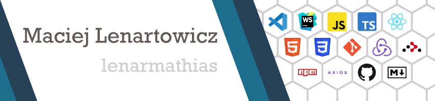

# 

## 

Hello! 👋

I'm a React Frontend Developer based in Poland. Passionate about creating dynamic apps and interfaces, 
 I find joy in learning new techniques, libraries, and increasing my knowledge to optimize my projects. 
 I thrive on turning innovative ideas into functional and user-friendly solutions. Whether it's crafting elegant UI components 
 or diving into the intricacies of state management in React, I enjoy the process of building seamless experiences for users.
 Ready to embark on exciting projects and collaborate on innovative solutions. Let's create something extraordinary together!

## 

I enjoy working with a variety of tools and technologies to bring ideas to life. Here are some of the key skills in my toolbox:

- **🔧 Languages:** 
- **🚀 Frontend:**    
- **📦 State Management:** 
- **🔗 Version Control:**  
- **⚙️ Build Tools:**  
- **🌐 UI Frameworks:**  
- **💻 IDEs/Editors:**  
- **🎨 Design Tools:** 
- **📦 Package Manager:** 
- **🌐 Other:** RESTful APIs, JSON

You can explore my repositories to see these technologies in action!

## 

## 

Don't hesitate to get in touch using any of the following methods:

&nbsp;&nbsp;
&nbsp;&nbsp;

Feel free to reach out for collaborations, questions, or just to say hello! 👋