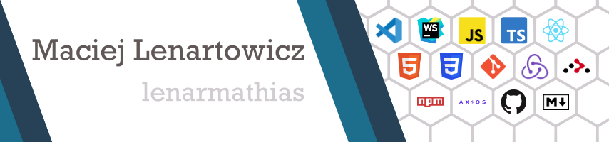

# 

## 

Hello! 👋

I'm a C++ & React Developer based in Poland. I enjoy building applications, learning how things work under the hood, and continuously improving my programming skills. 
 Currently, I'm focusing on C++ and modern software development, while continuing to work with JavaScript and React. I enjoy exploring new technologies, solving problems, and turning ideas into functional applications. 
 I'm always learning, experimenting, and building new projects along the way.

## 

I enjoy working with a variety of tools and technologies to bring ideas to life. Here are some of the key skills in my toolbox:

- **🔧 Languages:**   
- **⚙️ C++ Development:**   
- **💻 Toolchains:**  
- **🖥️ Operating Systems:**  
- **🚀 Frontend:**     
- **🔗 Version Control:**  
- **🛠️ Build Tools:**    
- **🔍 Code Quality:** 
- **🎨 UI & Design:**   
- **💻 IDEs & Editors:**   
- **📦 Package Manager:** 
- **🌐 Other:** RESTful APIs, JSON

You can explore my repositories to see these technologies in action!

## 

Don't hesitate to get in touch using any of the following methods:

  &nbsp;&nbsp;

Feel free to reach out for collaborations, questions, or just to say hello! 👋
